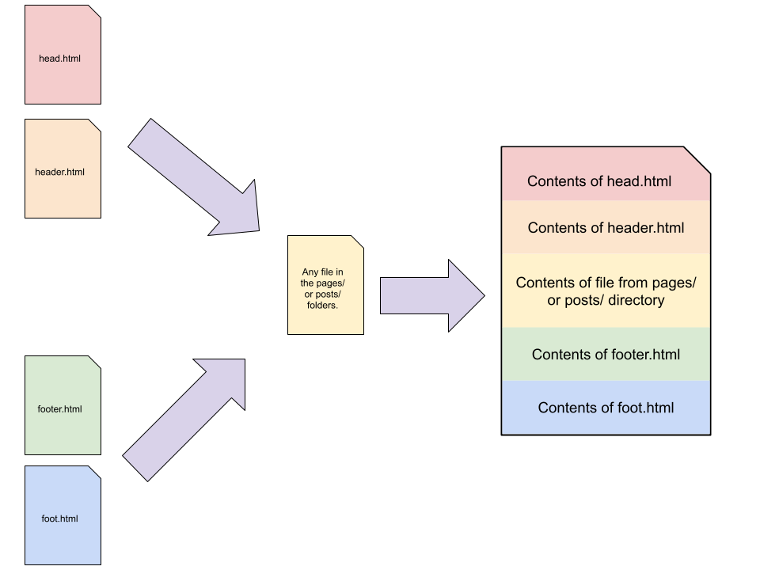

# Pysite
A Super Simple Static Site Creator written in Python.

# Installation

Copy `pysite.py` and `server.py` files into your project folder.

Create a Python Virtual Environment

`python -m venv .venv`

Activate the environment

`source .venv/bin/activate`

Install `markdown` and `watchdog` modules.

`pip install markdown watchdog`


# What it does
At the very basics, this script will take every HTML and Markdown file in a given folder and prepend header content and append footer content, creating a new HTML file. 

Each HTML or Markdown file from the selected folder will now have the same header (title, stylesheet, navigation) and footer content, which can be edited in one place.



## Site Setup
### Folders
Create the following folders in your project folder:

  - layout/
  - pages/
  - posts/
  - public/

The names of these folders can be changed in the `pysite.py` file.

### Files: Layout
Inside the layout folder, create the following files:

- layout/
    - `head.html` Contains the &lt;DOCTYPE&gt; tag, the &lt;html&gt; tag, the &lt;head&gt; and &lt;/head&gt; tags and any HTML that goes in-between, and the opening &lt;body&gt; tag.
    - `header.html` The &lt;header&gt; and &lt;/header&gt; tags and any HTML that goes in-between. Top navigation is usually good to put here. This file could also contain the &lt;main&gt; tag. (This content *can* go in the head.html file.)
    - `footer.html` The &lt;footer&gt; and &lt;/footer&gt; tags and any HTML that goes in-between, and any HTML that should go before the closing &lt;/body&gt; tag. This file could also contain the &lt;/main&gt; tag. (This content *can* go in the foot.html file.)
    - `foot.html` Just the closing &lt;/body&gt; and closing &lt;html&gt; tags. This could also have other HTML or Javascript that should be included before the closing &lt;/body&gt; tag.

These four files will be wrapped around every file in the `pages` and `posts` folders. At least the `head.html` and `foot.html` files must have content in them. The header.html and footer.html files do not need to have content.

The names of these files can be changed in the `pysite.py` file.

### Files: Pages
These files can contain the &lt;main&gt; and &lt;/main&gt; tags and anything that goes in-between. This is the main content of the webpage.

HTML and Markdown files inside the `pages` folder will be turned into HTML files to be served. Each file will have the head.html and header.html content prepended to it and the foot.html and footer.html content appended to it.

The combined HTML file is named the same as the filename in the pages folder. This will be served at the root level of the site. 

Sub-folders in the pages folder and files within those sub-folders will be recreated in a `docs` folder with the sub-folders and file paths recreated.

### Files: Posts
This is simply a duplicate of the `pages` functionality, but with a folder named `posts`. This name can be changed in the `pysite.py` file.

Similar to the files in the pages folder, these files will have the content of the files in the layout folder prepended and appended to them.

All posts will go into the `docs/posts/` folder.

Sub-folders and their files will also be recreated.


### Files: Public
The files and folders in the `public/` folder will be copied recursively to the `docs/` folder without alteration.

This is where you put the images, css and Javascript. Suggested file structure:

- public/
  - css/
    - style.css
  - images/
    - logo.png
    - picture1.jpg
  - js/
    - menu.js
  - files/
    - ExampleData.csv
    - GreatHandout.pdf

Access the files in these folders in your HTML and Markdown as absolute paths:

The file `public/images/logo.png` is accessed like `` for HTML and `` for Markdown.

The CSS file can be accessed in the `layout/head.html` file like so: `<link rel="stylesheet" href="/public/css/style.css">`


## Usage

After your files are created, run the following command in the terminal

```python server.py```

This will create the files in the `docs/` folder and start an HTML server. 

You can view the site at http://127.0.0.1:8000

The server will notice changes to files and restart the server every second so you can refresh the browser to the latest changes.

You can transfer the files from the `docs/` folder to your web host for static file serving glory! 

Select to serve the `docs/` folder for easy use with GitHub Pages. 

The name of this folder can be changed in the `pysite.py` file.
