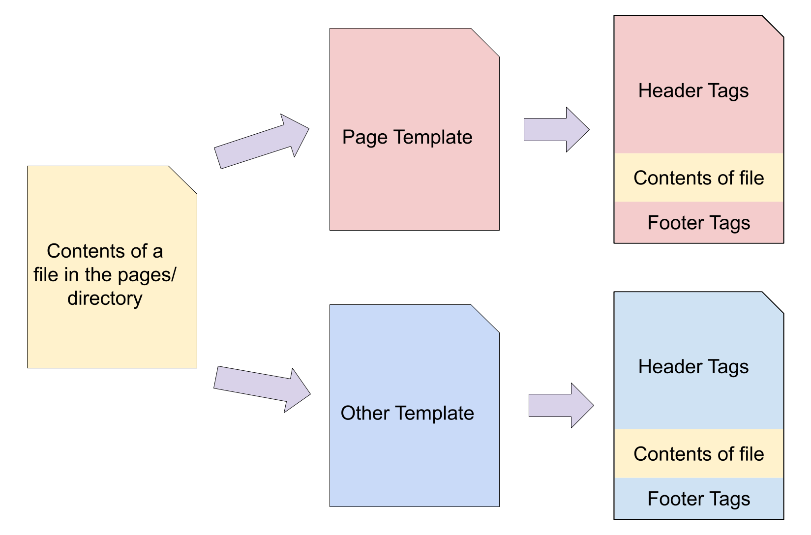

# Pysite
A Super Simple Static Site Creator written in Python.


# Requirements

- Python 3.14+
- Terminal and Code Editor (VS Code)


# What it does

At the very basics, this script will take every HTML and Markdown file in a given set of folders and insert the contents of that file into a template, creating a new HTML file. 

Each HTML or Markdown file from the selected folder will now have the same header (title, stylesheet, navigation) and footer content, which can be edited from the template file.




# Installation

1. Copy the `pysite.py`, `server.py`, and `requirements.txt` files into your project folder.

2. Create a Python Virtual Environment

`python -m venv .venv`

3. Activate the environment

`source .venv/bin/activate`

4. Install modules.

`pip install -r requirements.txt`

## Site Setup
### Folders
Create the following folders in your project folder:

  - __layout/
  - pages/
  - posts/
  - public/

The names of these folders can be changed in the `pysite.py` file.

#### Folders: Top-level folders

Any folder created at the top level of the project (the same level as the pages, posts, public and __layout folders) will be scanned for files to be converted. Each folder and it's sub-folders will be recreated with the altered HTML files in place. Any folder with a name that begins with two underscores (__layout, for example), and the docs/ folder will be ignored.

### Files: Layout
Inside the __layout folder, create the following files:

- __layout/
    - `page.html` Is the page template. This file contains all of the HTML, with a placeholder, to create a 'page' of the website.
    - `post.html` Is the post template. This file contains all of the HTML, with a placeholder, to create a 'post' page of the website.

Other template files can be created here. Each of these files should contain the basic HTML structure (!DOCTYPE, &lt;html&gt;, &lt;title&gt;, &lt;link&gt;, &lt;meta&gt;, &lt;body&gt;, &lt;main&gt;, etc... and their corresponding closing tags) to create a page of the website.

An HTML or Markdown file selects which template to use in the YAML frontmatter of the file:

    template: page


### Files: Pages
These files contain the main content of the webpage.

HTML and Markdown files inside the `pages` folder will be turned into HTML files to be served. Each file's content will inserted into the placeholder section of the specified template file.

The combined HTML file is named the same as the filename in the pages folder. This will be served at the root level of the website. 

Sub-folders in the pages folder and files within those sub-folders will be recreated in a `docs` folder with the sub-folders and file paths recreated.

### Files: Posts
This is simply a duplicate of the `pages` functionality, but with a folder named `posts`. This name can be changed in the `pysite.py` file.

Similar to the files in the pages folder, these files will have the content of the files in the layout folder prepended and appended to them.

All posts will go into the `docs/posts/` folder.

Sub-folders and their files will also be recreated.


### Files: Public
The files and folders in the `public/` folder will be copied recursively to the `docs/` folder without alteration.

This is where you put the images, css and Javascript. Suggested file structure:

- public/
  - css/
    - style.css
  - images/
    - logo.png
    - picture1.jpg
  - js/
    - menu.js
  - files/
    - ExampleData.csv
    - GreatHandout.pdf

Access the files in these folders in your HTML and Markdown as absolute paths:

The file `public/images/logo.png` is accessed like `` for HTML and `` for Markdown.

The CSS file can be accessed in the `layout/head.html` file like so: `<link rel="stylesheet" href="/public/css/style.css">`

### Files: Top-level Files

All files in the top level of the project (the same level as the posts, pages, public and __layout folders) are ignored.

## Usage

After your files are created, run the following command in the terminal

```python server.py```

This will create the `docs/` folder, create any files and place them in the appropriate folders, and start an HTML server. 

You can view the site at http://127.0.0.1:8000

The server will notice changes to files and restart the server every second so you can refresh the browser to the latest changes.

You can transfer the files from the `docs/` folder to your web host for static file serving glory! 

If using GitHub Pages, choose to serve files from the `docs/` folder. 

The name of the static files output folder can be changed in the `pysite.py` file.
